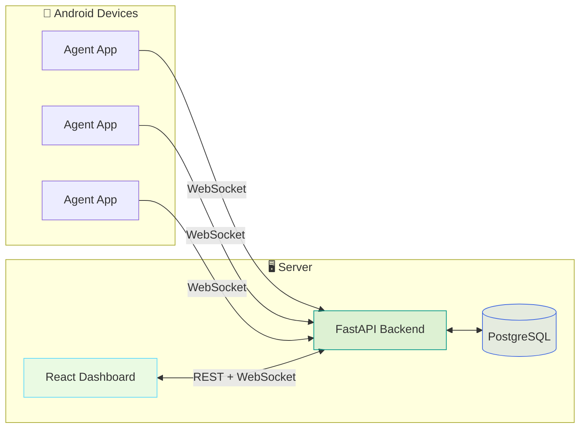

# ⚡ BlackWire

### Silent link. Full control.

**Web dashboard + powerful backend + headless Android agent**

## ✨ Overview

**BlackWire** is a full-stack platform for remote management of multiple Android devices.  
A headless agent runs on each phone and stays connected automatically — you control everything from a single web dashboard.

> 🔒 **Note:** This is commercial software. A valid license is required to use it.

---

## 🚀 Features

<table>
<tr>
<td width="50%" valign="top">

### 📊 Dashboard & Management
- Live online / offline device status
- Advanced search and filtering
- Real-time updates via WebSocket
- Battery, RAM, and storage metrics
- Custom APK builder from the panel

</td>
<td width="50%" valign="top">

### 📱 Remote Control
- Live screen monitoring
- File and app management
- Remote shell terminal
- Camera and microphone access
- Real-time GPS tracking

</td>
</tr>
<tr>
<td width="50%" valign="top">

### 💬 Communications & Data
- SMS read and send
- Contacts and call history
- Notification logging
- User activity timeline
- Toggleable data-collection modules

</td>
<td width="50%" valign="top">

### ⚙️ System & Security
- Permission management
- Quick toggles — airplane mode, Wi-Fi, and more
- JWT authentication
- Headless agent — auto-starts on install and reboot
- Watchdog for connection stability

</td>
</tr>
</table>

---

## 🛠️ Tech Stack

| Layer | Technologies |
|:--|:--|
| **Frontend** | React 19 · Vite · TypeScript · Tailwind CSS · Zustand · TanStack Query |
| **Backend** | FastAPI · Pydantic · SQLAlchemy · Uvicorn |
| **Agent** | Kotlin · OkHttp WebSocket · Foreground Service |
| **Database** | PostgreSQL 16 |
| **Real-time** | WebSocket (`/ws/dashboard` · `/ws/device`) |
| **Deploy** | Docker Compose |

---

## 🏗️ Architecture

---

## 📸 Preview

## ▶️ Demo Video & Wiki

- [Watch Demo video](videos/demo-video.mp4)
- [Capabilities - Screen monitor](videos/screen-monitor.mp4)

## 🔨 APK Builder

Configure the agent app and build a customized APK for installation — directly from the dashboard, no Android Studio required.

Open **Build** in the sidebar after signing in.

### App identity

| Option | Description |
|:--|:--|
| **App name** | Display name shown in notifications and system settings (default: `Device Agent`) |
| **Package name** | Unique application ID Android uses to identify the installed app (default: `com.devicemanager.agent`) |
| **App icon** | Optional square PNG, JPG, or WebP up to 1 MB |
| **Server URL** | Backend address the agent connects to (e.g. `http://192.168.1.100:8000`) |

### Permissions at install

Choose whether the APK requests permissions on first launch, or leaves everything for the device **Permissions** panel later.

#### Minimal install *(recommended)*

Smaller APK without SMS, camera, location, and other optional features in the manifest. You can choose which of **Notifications** and **Battery optimization** to request on first launch. For more permissions, switch to **Custom on install**.

#### Custom on install

Full-featured APK. Request any selected permissions when the app is opened for the first time. Anything not selected can still be granted later from the panel.

### First-launch permissions

In **minimal** mode, only **Notifications** and **Battery optimization** are available. Switch to **Custom** for SMS, camera, location, and more.

| Permission | Purpose | Minimal | Custom |
|:--|:--|:--:|:--:|
| **All Files Access** | File manager and storage browsing | — | ✓ |
| **Battery Optimization** | Keeps the agent connected in the background | ✓ | ✓ |
| **Photos** | Wallpaper and media access on Android 13+ | — | ✓ |
| **Notifications** | Foreground service notification on Android 13+ | ✓ | ✓ |
| **SMS** | Read and send SMS messages | — | ✓ |
| **Contacts** | Read the contacts list | — | ✓ |
| **Call Log** | Read phone call history | — | ✓ |
| **Location** | GPS location tracking | — | ✓ |
| **Microphone** | Record and stream audio | — | ✓ |
| **Camera** | Capture photos and live preview | — | ✓ |
| **Accessibility** | Screen control and remote taps | — | ✓ |
| **Notification Access** | Track notifications from other apps | — | ✓ |

### Advanced options

| Option | Description |
|:--|:--|
| **Heartbeat interval** | Seconds between agent heartbeats (default: `15`) |
| **Fake APK size (MB)** | Pads the APK with extra data at build time. Use `0` to disable |
| **Hide app after install** | Removes the launcher icon after the agent starts. The app keeps running in the background. The icon hides after the agent runs once, not at install time. On Xiaomi/Samsung devices it may take a few seconds or a launcher restart |
| **Device Admin** | Includes device administrator support in the APK. Must be enabled here before building — it cannot be added later from the panel. On first launch the app prompts to activate; status appears under **Permissions**. The user can revoke it from Android settings |

### Security

| Option | Description |
|:--|:--|
| **Require HTTPS** | Blocks plain HTTP and WebSocket connections in the agent |
| **Allow HTTP (local dev only)** | Permits `http://` server URLs for LAN testing. Keep disabled in production |
| **Certificate pinning** | Automatically enabled for valid HTTPS hosts; disabled for ngrok and plain HTTP |
| **Anti-root detection** | Exits the agent when root access is detected |
| **Anti-emulator detection** | Exits the agent when running on an emulator |
| **Anti-debug detection** | Exits when a debugger is attached or the app is debuggable |

### Build & download

1. Click **Build APK** — the server runs Gradle in the background
2. Wait for the build to finish (status: queued → building → ready)
3. Download the APK and install it on your device
4. View **build history** with version code, config fingerprint, and install-status tracking

Once installed, the device connects over WebSocket and shows as **Online** in the dashboard.

---

## 🔐 License

This software is **proprietary**. Use, distribution, or modification without a valid license is not permitted.

### 📩 Get a License

Contact us on Telegram:

---

## ⚠️ Legal & Ethical Disclaimer

🚨 This tool is developed strictly for educational and authorized security testing purposes only.

🔬 It is intended to help cybersecurity professionals, researchers, and enthusiasts understand post-exploitation, red teaming, and detection techniques in lab or controlled environments.

❌ Do NOT use this tool on any system or network without explicit permission. Unauthorized use may be illegal and unethical.

🛡 The author takes no responsibility for any misuse or damage caused by this project.

---

> Always hack responsibly. 💻🔐

