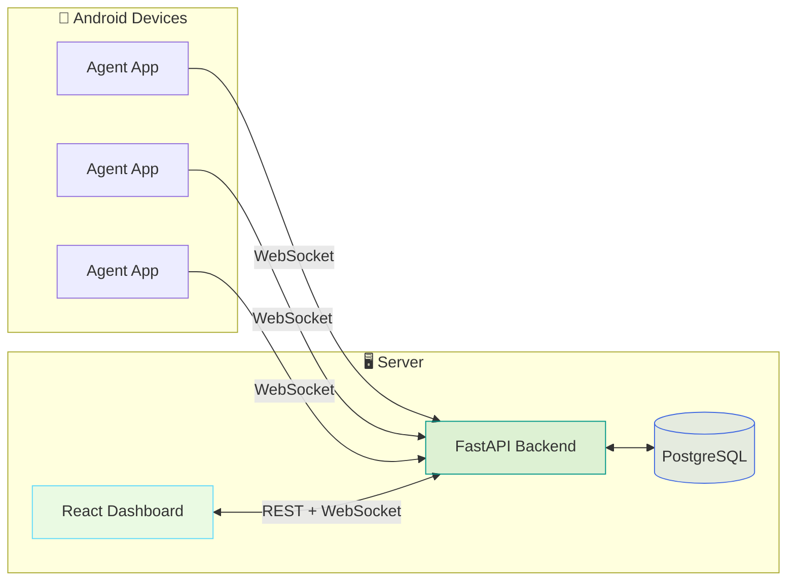

# ⚡ BlackWire

### Silent link. Full control.

**Web dashboard + powerful backend + headless Android agent**

## ✨ Overview

**BlackWire** is a full-stack platform for remote management of multiple Android devices.  
A headless agent runs on each phone and stays connected automatically — you control everything from a single web dashboard.

> 🔒 **Note:** This is commercial software. A valid license is required to use it.

---

## 🚀 Features

<table>
<tr>
<td width="50%" valign="top">

### 📊 Dashboard & Management
- Live online / offline device status
- Advanced search and filtering
- Real-time updates via WebSocket
- Battery, RAM, and storage metrics
- Custom APK builder from the panel

</td>
<td width="50%" valign="top">

### 📱 Remote Control
- Live screen monitoring
- File and app management
- Remote shell terminal
- Camera and microphone access
- Real-time GPS tracking

</td>
</tr>
<tr>
<td width="50%" valign="top">

### 💬 Communications & Data
- SMS read and send
- Contacts and call history
- Notification logging
- User activity timeline
- Toggleable data-collection modules

</td>
<td width="50%" valign="top">

### ⚙️ System & Security
- Permission management
- Quick toggles — airplane mode, Wi-Fi, and more
- JWT authentication
- Headless agent — auto-starts on install and reboot
- Watchdog for connection stability

</td>
</tr>
</table>

---

## 🛠️ Tech Stack

| Layer | Technologies |
|:--|:--|
| **Frontend** | React 19 · Vite · TypeScript · Tailwind CSS · Zustand · TanStack Query |
| **Backend** | FastAPI · Pydantic · SQLAlchemy · Uvicorn |
| **Agent** | Kotlin · OkHttp WebSocket · Foreground Service |
| **Database** | PostgreSQL 16 |
| **Real-time** | WebSocket (`/ws/dashboard` · `/ws/device`) |
| **Deploy** | Docker Compose |

---

## 🏗️ Architecture

---

## 📸 Preview

## 🔐 License

This software is **proprietary**. Use, distribution, or modification without a valid license is not permitted.

### 📩 Get a License

Contact us on Telegram:

---

## ⚠️ Legal & Ethical Disclaimer

🚨 This tool is developed strictly for educational and authorized security testing purposes only.

🔬 It is intended to help cybersecurity professionals, researchers, and enthusiasts understand post-exploitation, red teaming, and detection techniques in lab or controlled environments.

❌ Do NOT use this tool on any system or network without explicit permission. Unauthorized use may be illegal and unethical.

🛡 The author takes no responsibility for any misuse or damage caused by this project.

---

> Always hack responsibly. 💻🔐

